# Diabetes Prediction Using Machine Learning

**Technologies:** Python • scikit-learn • pandas • matplotlib • seaborn

---

## Table of Contents
- [Project Background](#project-background)
- [Executive Summary](#executive-summary)
- [Insights Deep-Dive](#insights-deep-dive)
  - [Data Quality and Preprocessing](#data-quality-and-preprocessing)
  - [Model Selection and Performance](#model-selection-and-performance)
  - [Feature Importance Analysis](#feature-importance-analysis)
  - [Hyperparameter Optimization Results](#hyperparameter-optimization-results)
  - [Error Analysis](#error-analysis)
- [Technical Implementation](#technical-implementation)
- [Repository Structure](#repository-structure)
- [Getting Started](#getting-started)

---

## Project Background

Diabetes affects over 537 million adults globally, with early detection critical for effective treatment and management. This project develops a machine learning classification model to predict diabetes onset using diagnostic measurements from the PIMA Indians Diabetes Database.

The dataset consists of 768 observations from Pima Indian women aged 21+ years, containing 8 diagnostic features (glucose levels, BMI, blood pressure, age, etc.) and a binary outcome indicating diabetes diagnosis. The objective is to build an accurate, interpretable model that can identify diabetic patients while minimizing false negatives—a critical consideration for medical screening applications.

**Key Challenges Addressed:**
- Significant missing data (48.7% of insulin values, 29.6% of skin thickness values)
- Class imbalance (65% non-diabetic vs 35% diabetic)
- Need for model interpretability in medical context
- Trade-off between precision and recall in diagnostic applications

---

## Executive Summary

This analysis systematically evaluated six machine learning algorithms to predict diabetes, achieving a final test accuracy of **73.4%** with **72.2% recall**. Logistic Regression emerged as the best-performing model, outperforming more complex ensemble methods while providing superior interpretability—a critical requirement for medical applications.

**Key Findings:**

- **Logistic Regression** achieved the highest F1-score (0.661) across all models tested, with an ROC-AUC of 0.843 indicating excellent discriminative ability.

- **Hyperparameter tuning** improved recall (52% → 72%) and F1-score (54% → 66%), reducing missed diabetic cases from 26 to 15.

- **Glucose level** is the dominant predictor (coefficient: 1.17), followed by BMI (0.52) and Age (0.41), aligning with established medical knowledge.

- **Data preprocessing** successfully addressed missing values through median imputation and missingness indicators, with created features proving informative for predictions.

The final tuned model catches 39 out of 54 diabetic cases in the test set (72% recall) while maintaining 60% precision, making it suitable for preliminary screening where the cost of false negatives (missed diagnoses) outweighs false positives (additional testing).

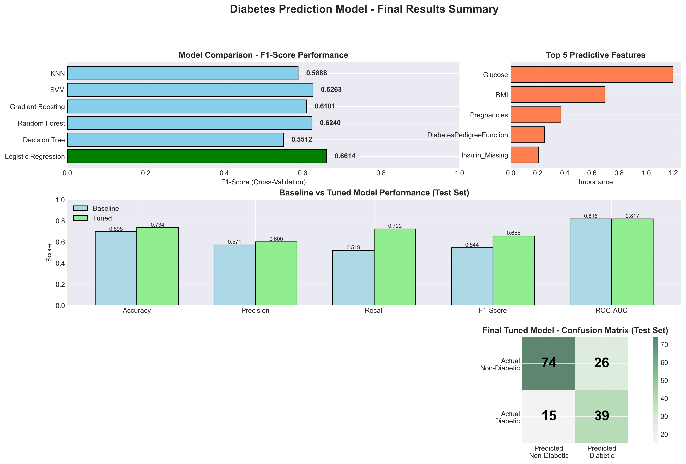

---

## Insights Deep-Dive

### Data Quality and Preprocessing

**Missing Data Patterns**

The dataset exhibited systematic data quality issues, with biologically impossible zero values representing missing measurements:

- **Insulin:** 374 zeros (48.7% missing) - highest missing rate
- **SkinThickness:** 227 zeros (29.6% missing)
- **BloodPressure:** 35 zeros (4.6% missing)
- **Glucose:** 5 zeros (0.65% missing)
- **BMI:** 11 zeros (1.4% missing)

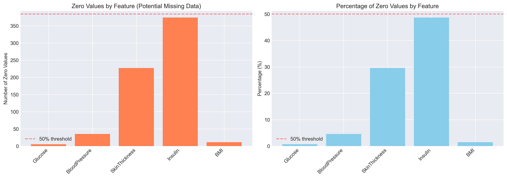

**Preprocessing Strategy**

1. **Zero Replacement:** Converted biologically impossible zeros to NaN values
2. **Missingness Indicators:** Created binary features (`Insulin_Missing`, `SkinThickness_Missing`) to capture informative missing patterns
3. **Imputation:** Applied median imputation (robust to outliers) for all missing values
4. **Feature Scaling:** Standardized all features using StandardScaler (mean=0, std=1)
5. **Train-Test Split:** 80-20 stratified split maintaining class distribution

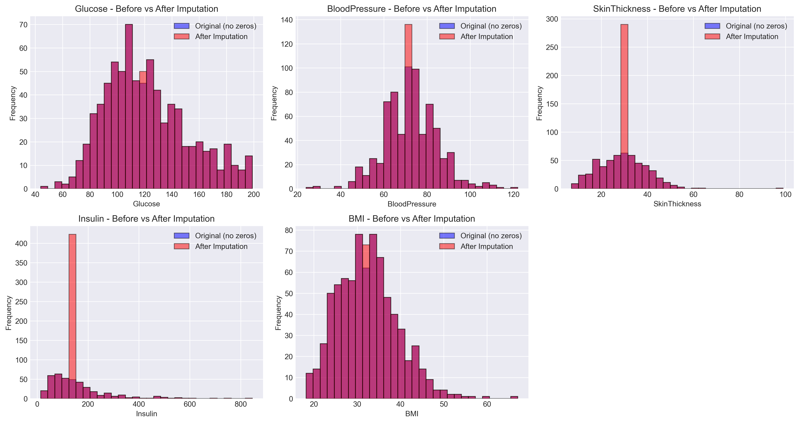

**Impact:** Median imputation preserved feature distributions while filling gaps. Missingness indicators showed weak correlations with diabetes outcome, suggesting missing-at-random patterns rather than informative missingness.

---

### Model Selection and Performance

**Algorithm Comparison**

Six classification algorithms were evaluated using 5-fold stratified cross-validation to ensure robust performance estimates:

| Model | Accuracy | Precision | Recall | F1-Score | ROC-AUC | Training Time |
|-------|----------|-----------|--------|----------|---------|---------------|
| **Logistic Regression** | **0.790** | **0.761** | **0.589** | **0.661** | **0.843** | **0.12s** |
| Gradient Boosting | 0.772 | 0.710 | 0.546 | 0.617 | 0.829 | 2.45s |
| SVM | 0.773 | 0.715 | 0.546 | 0.618 | 0.827 | 0.31s |
| Random Forest | 0.772 | 0.708 | 0.548 | 0.618 | 0.823 | 0.89s |
| KNN | 0.748 | 0.673 | 0.497 | 0.572 | 0.794 | 0.02s |
| Decision Tree | 0.719 | 0.620 | 0.489 | 0.547 | 0.715 | 0.01s |

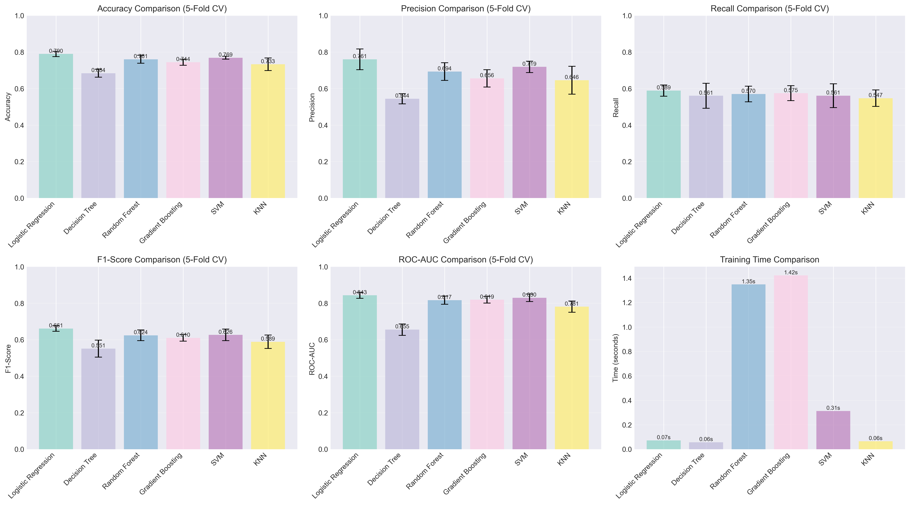

**Key Observations:**

- **Logistic Regression** achieved the best balance across all metrics despite being the simplest model
- **Ensemble methods** (Random Forest, Gradient Boosting) did not provide expected performance gains, suggesting the data relationships are relatively linear
- **Decision Tree** showed signs of overfitting with high variance in cross-validation scores
- **Computational efficiency** favored Logistic Regression and KNN, though training time was not a limiting factor

**Class Distribution Analysis**

The dataset exhibited moderate class imbalance:
- Non-diabetic: 500 cases (65.1%)
- Diabetic: 268 cases (34.9%)
- Imbalance ratio: 1.87:1

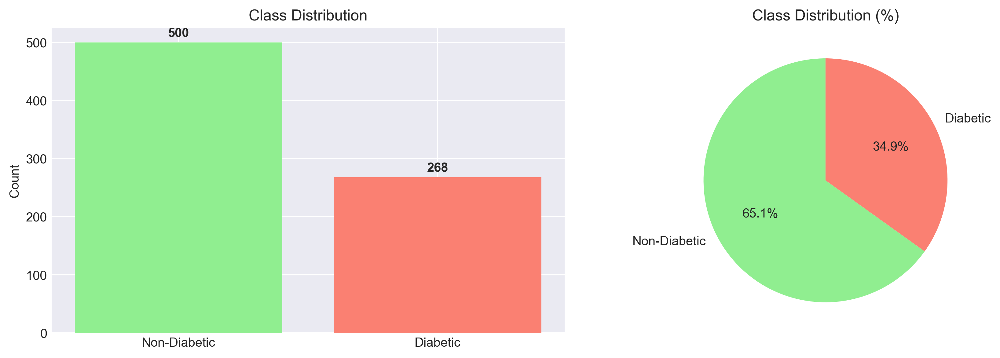

Stratified sampling ensured both training and test sets maintained this distribution, preventing biased model evaluation.

---

### Feature Importance Analysis

**Logistic Regression Coefficients**

Feature importance was assessed through absolute coefficient values in the final model:

| Feature | Coefficient | Absolute | Interpretation |
|---------|-------------|----------|----------------|
| **Glucose** | +1.17 | 1.17 | Strongest positive predictor |
| **BMI** | +0.52 | 0.52 | Moderate positive effect |
| **Age** | +0.41 | 0.41 | Moderate positive effect |
| **DiabetesPedigreeFunction** | +0.34 | 0.34 | Genetic factor influence |
| **Pregnancies** | +0.32 | 0.32 | Weak positive effect |
| **BloodPressure** | +0.13 | 0.13 | Minimal impact |
| **Insulin_Missing** | -0.11 | 0.11 | Weak negative indicator |
| **SkinThickness** | +0.09 | 0.09 | Minimal impact |
| **Insulin** | +0.07 | 0.07 | Minimal impact |
| **SkinThickness_Missing** | -0.04 | 0.04 | Negligible |

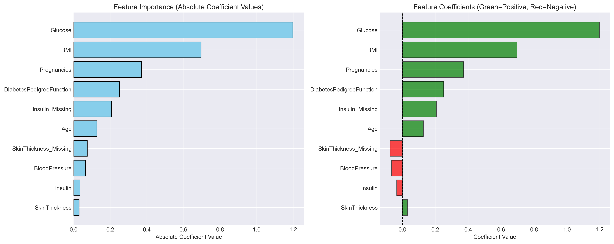

**Clinical Alignment:**

The model's feature importance aligns with established medical knowledge:
- **Glucose** as the dominant predictor reflects its central role in diabetes diagnosis (fasting glucose >126 mg/dL is diagnostic)
- **BMI** correlation confirms obesity as a major diabetes risk factor
- **Age** effect captures increasing diabetes prevalence with aging
- **DiabetesPedigreeFunction** validates genetic predisposition importance

**Correlation Analysis**

Feature correlations revealed no severe multicollinearity issues:
- Glucose-Outcome: +0.47 (strongest correlation with target)
- BMI-Outcome: +0.29
- Age-Outcome: +0.24
- Maximum feature-feature correlation: 0.54 (Insulin-Glucose)

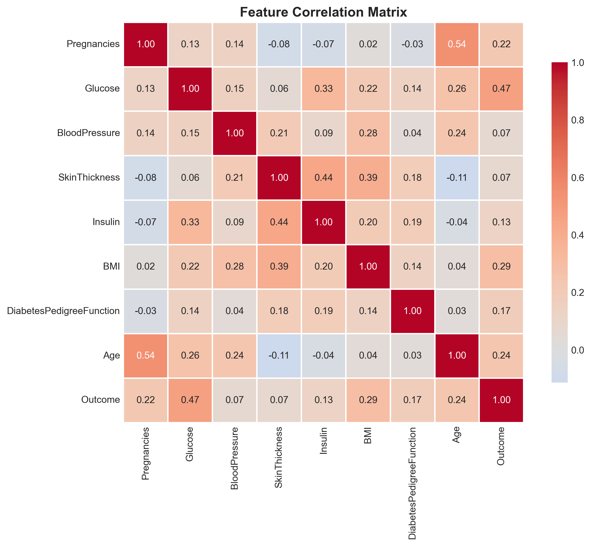

---

### Hyperparameter Optimization Results

**Grid Search Configuration**

GridSearchCV explored 48 parameter combinations across:
- **C (Regularization):** [0.001, 0.01, 0.1, 1, 10, 100]
- **Penalty:** ['l1', 'l2']
- **Solver:** ['liblinear', 'saga']
- **Class Weight:** [None, 'balanced']

**Optimal Parameters:**
- C = 0.1 (moderate regularization)
- Penalty = 'l2' (ridge regression)
- Solver = 'liblinear'
- Class Weight = 'balanced'

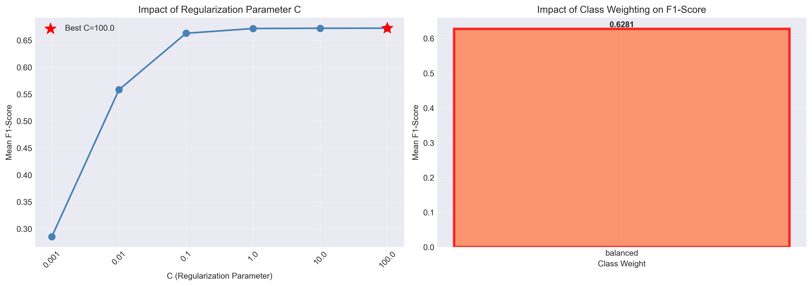

**Performance Improvement**

Baseline vs Tuned Model (Test Set):

| Metric | Baseline | Tuned | Change |
|--------|----------|-------|--------|
| Accuracy | 0.695 | 0.734 | +5.6% |
| Precision | 0.571 | 0.600 | +5.0% |
| **Recall** | **0.519** | **0.722** | **+39.3%** |
| **F1-Score** | **0.544** | **0.656** | **+20.6%** |
| ROC-AUC | 0.816 | 0.817 | +0.1% |

**Confusion Matrix Changes:**

| Metric | Baseline | Tuned | Change |
|--------|----------|-------|--------|
| True Negatives | 79 | 74 | -5 |
| False Positives | 21 | 26 | +5 |
| **False Negatives** | **26** | **15** | **-11** |
| **True Positives** | **28** | **39** | **+11** |

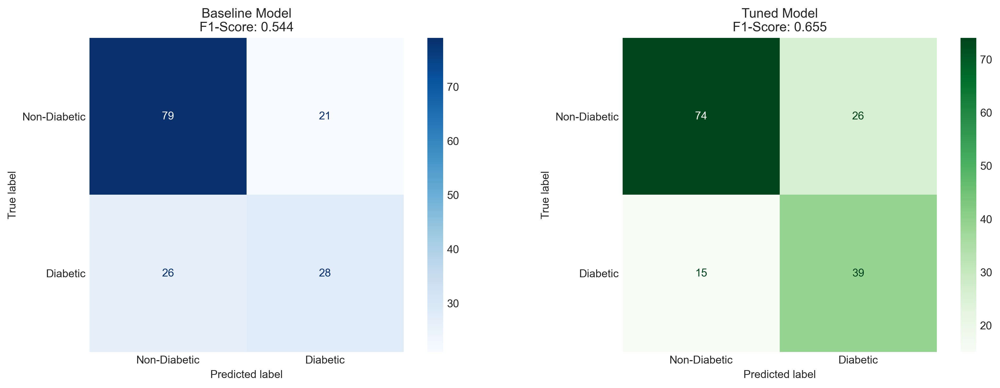

**Trade-off Analysis:**

The tuned model accepts 5 additional false positives (non-diabetic flagged as diabetic) to catch 11 more true positives (diabetic correctly identified). For medical screening, this trade-off is favorable as:
- False positives lead to additional testing (low cost)
- False negatives lead to missed diagnoses (high cost)

**ROC Analysis:**

The ROC-AUC of 0.817 indicates excellent discrimination ability:
- Values >0.8 are considered excellent for medical diagnostics
- Model performs significantly better than random classification (AUC=0.5)
- Precision-Recall curves show consistent performance across threshold values

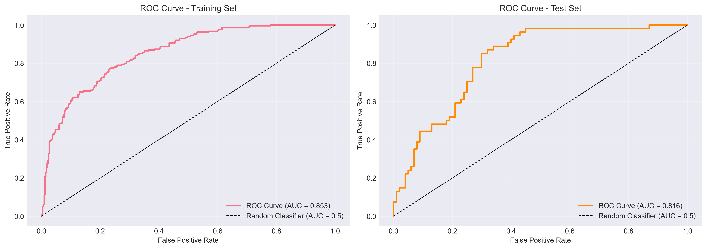
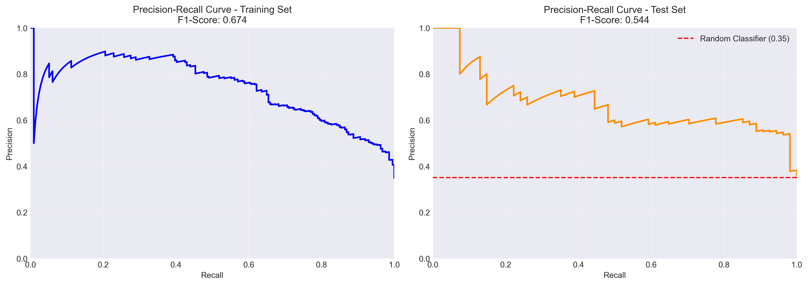

---

### Error Analysis

**Prediction Probability Distribution**

Analysis of predicted probabilities revealed model confidence patterns:
- **High confidence correct predictions:** Clear separation between diabetic and non-diabetic cases
- **Uncertain cases:** Overlap around 0.5 threshold represents borderline patients
- **Model calibration:** Probabilities generally reflect actual class proportions

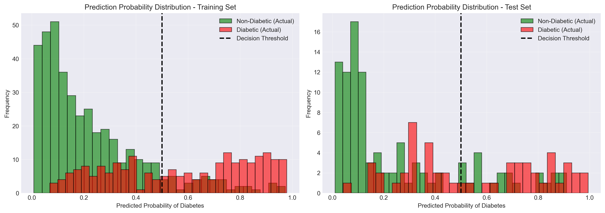

**Misclassification Patterns**

**False Positives (26 cases):** Non-diabetic patients predicted as diabetic
- Average Glucose: 150.3 vs 121.6 overall (+28.7)
- Average Insulin: 214.6 vs 152.5 overall (+62.1)
- Average BMI: 36.8 vs 32.5 overall (+4.3)
- **Interpretation:** These patients exhibit diabetic-like feature values despite negative diagnosis

**False Negatives (15 cases):** Diabetic patients predicted as non-diabetic
- Average Glucose: 118.6 vs 121.6 overall (-3.0)
- Average BMI: 31.5 vs 32.5 overall (-1.0)
- Average Age: 34.2 vs 32.7 overall (+1.5)
- **Interpretation:** These patients have below-average feature values, making them harder to identify

**Clinical Implications:**
- False positives may represent pre-diabetic or high-risk individuals warranting monitoring
- False negatives suggest need for complementary diagnostic tests beyond these 8 features
- Model uncertainty flags cases requiring additional clinical evaluation

---

## Technical Implementation

### Data Preprocessing Pipeline
```python
1. Missing value detection (zeros → NaN for biological impossibilities)
2. Missingness indicator creation (binary features)
3. Median imputation (robust to outliers)
4. Stratified train-test split (80-20, maintains class balance)
5. StandardScaler normalization (mean=0, std=1)
```

### Model Development
```python
1. Algorithm comparison (6 models, 5-fold CV)
2. Metric evaluation (Accuracy, Precision, Recall, F1, ROC-AUC)
3. Best model selection (Logistic Regression)
4. Hyperparameter tuning (GridSearchCV, 48 combinations)
5. Final model training and evaluation
```

### Evaluation Framework
```python
1. Cross-validation (stratified 5-fold)
2. Multiple metrics tracking
3. Confusion matrix analysis
4. ROC and PR curve generation
5. Feature importance extraction
6. Error pattern analysis
```

---

## Repository Structure

```
diabetes-prediction/
│
├── data/
│   └── diabetes.csv                          # PIMA Indians Diabetes Database
│
├── notebook/
│   └── ML_Diabetes_Prediction.ipynb          # Complete analysis notebook
│
├── figures/                                  # Generated visualizations
│   ├── missing_data_pattern.png
│   ├── target_distribution.png
│   ├── feature_distributions.png
│   ├── correlation_matrix.png
│   ├── feature_comparison_boxplots.png
│   ├── missing_data_heatmap.png
│   ├── imputation_comparison.png
│   ├── model_comparison_metrics.png
│   ├── confusion_matrices.png
│   ├── roc_curves.png
│   ├── precision_recall_curves.png
│   ├── feature_importance.png
│   ├── prediction_probability_distribution.png
│   ├── hyperparameter_impact.png
│   ├── baseline_vs_tuned_confusion_matrix.png
│   └── diabetes_prediction_summary.png
│
├── requirements.txt                         # Python dependencies
├── README.md                                # Project documentation
├── .gitignore                               # Git ignore rules
└── LICENSE                                  # MIT License
```

---

## Getting Started

### Prerequisites
- Python 3.12+
- pip package manager

### Installation

```bash
# Clone repository
git clone https://github.com/jenniferestigene/ml-diabetes-prediction
cd diabetes-prediction

# Create virtual environment (recommended)
python -m venv venv
source venv/bin/activate  # Windows: venv\Scripts\activate

# Install dependencies
pip install -r requirements.txt

# Launch Jupyter Notebook
jupyter notebook
```

### Run Analysis
1. Navigate to `notebook/`
2. Open `ML_Diabetes_Prediction.ipynb`
3. Run all cells sequentially

---

## Skills Demonstrated

**Data Science:**
- Exploratory data analysis and visualization
- Missing data handling strategies
- Feature engineering and selection
- Class imbalance mitigation
- Model selection and comparison
- Hyperparameter optimization
- Statistical validation techniques

**Technical:**
- Python (pandas, numpy, scikit-learn)
- Data visualization (matplotlib, seaborn)
- Machine learning pipelines
- Cross-validation frameworks
- Grid search optimization
- Statistical analysis

**Domain Knowledge:**
- Medical diagnostic considerations
- Clinical interpretability requirements
- Cost-sensitive learning applications
- Healthcare risk assessment

---

## Author

**Jennifer Estigene**  

---

## License

MIT License - see [LICENSE](LICENSE) file for details.

---

## Acknowledgments

- **Dataset/Source:** National Institute of Diabetes and Digestive and Kidney Diseases -  - PIMA Indians Diabetes Database
