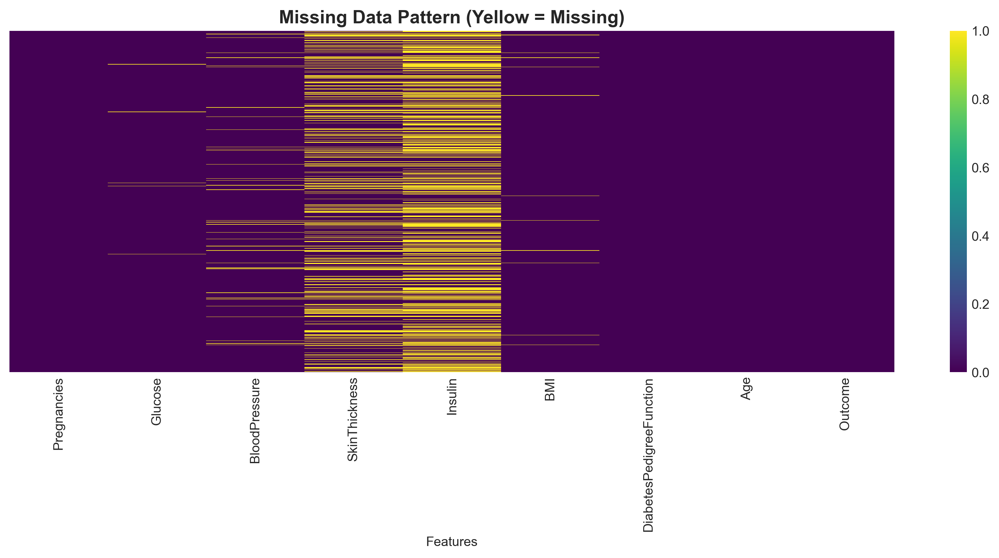
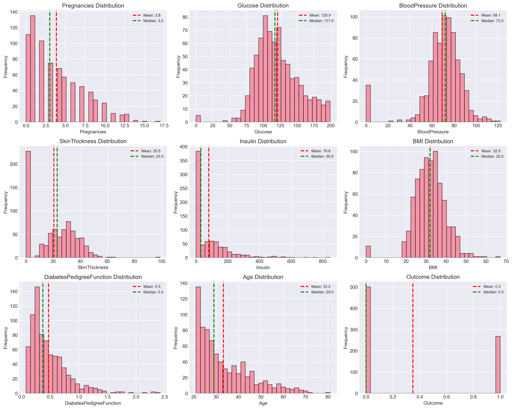
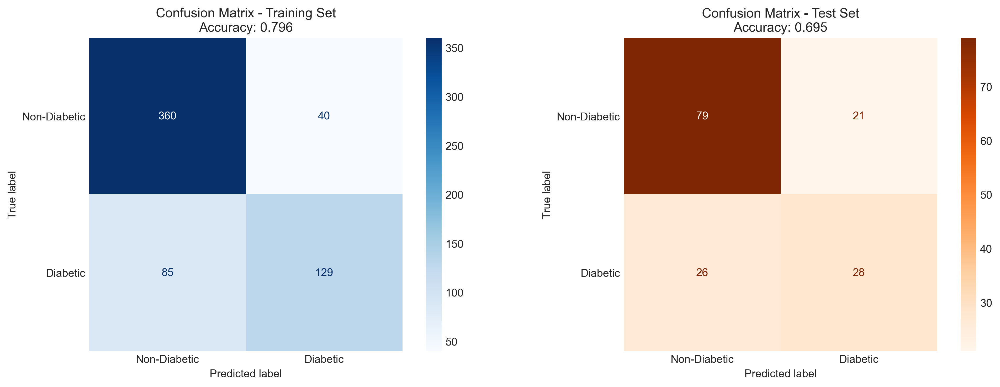

# Visualizations

All figures generated during exploratory data analysis, model training, and evaluation.

## Exploratory Data Analysis

### Data Quality

**Missing Data Pattern** - Distribution of zero values representing missing data across features

**Missing Data Heatmap** - Visual pattern of missing values before imputation

**Imputation Comparison** - Feature distributions before and after median imputation

### Target Variable

**Target Distribution** - Class balance: 65% non-diabetic vs 35% diabetic

### Features

**Feature Distributions** - Histogram of all 8 diagnostic features with mean/median

**Correlation Matrix** - Feature correlations and relationships with diabetes outcome

**Feature Comparison** - Diabetic vs non-diabetic feature value distributions

## Model Performance

### Model Comparison

**Model Comparison** - Performance across 6 algorithms using 5-fold cross-validation

### Baseline Model Evaluation

**Confusion Matrices** - Training and test set performance for baseline Logistic Regression

**ROC Curves** - Receiver Operating Characteristic curves for training and test sets

**Precision-Recall Curves** - Trade-off analysis between precision and recall

**Feature Importance** - Logistic Regression coefficients showing Glucose as dominant predictor

**Prediction Probabilities** - Distribution of model confidence for diabetic and non-diabetic cases

## Hyperparameter Tuning

**Hyperparameter Impact** - Effect of regularization (C) and class weighting on F1-score

**Model Comparison** - Baseline vs optimized model showing +39% recall improvement

## Final Results

**Complete Summary** - Comprehensive view of model selection, features, metrics, and final confusion matrix

---

**All visualizations generated using:** matplotlib 3.7+ and seaborn 0.12+
